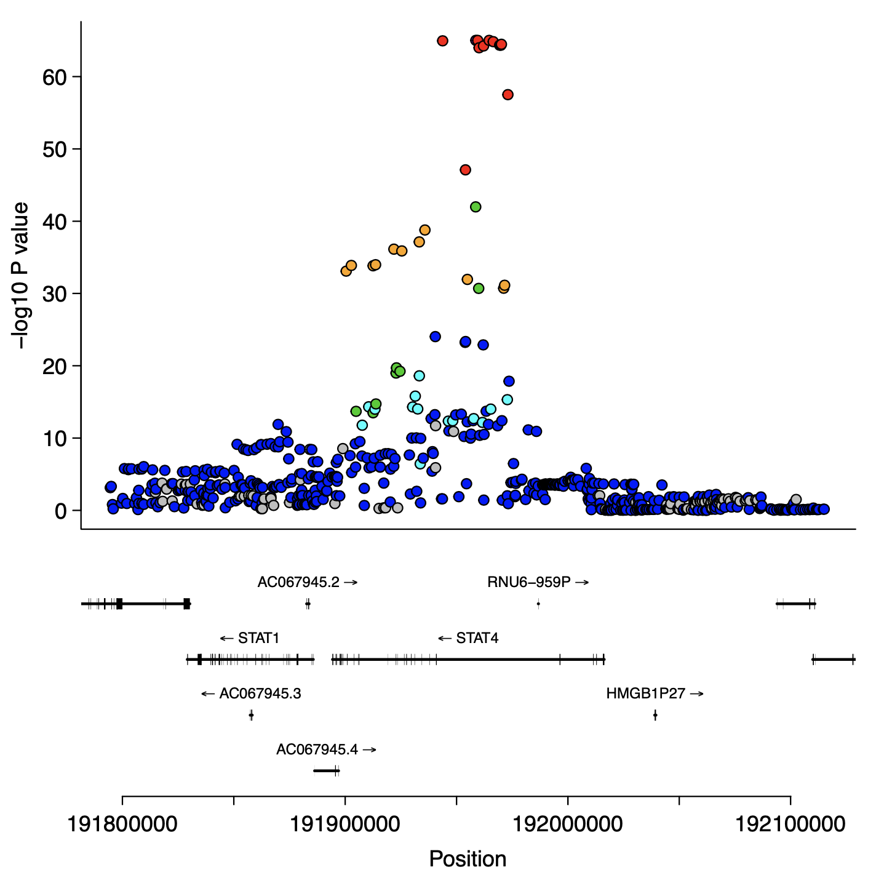
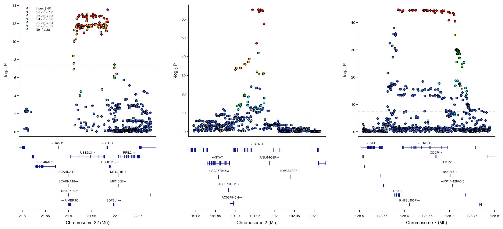
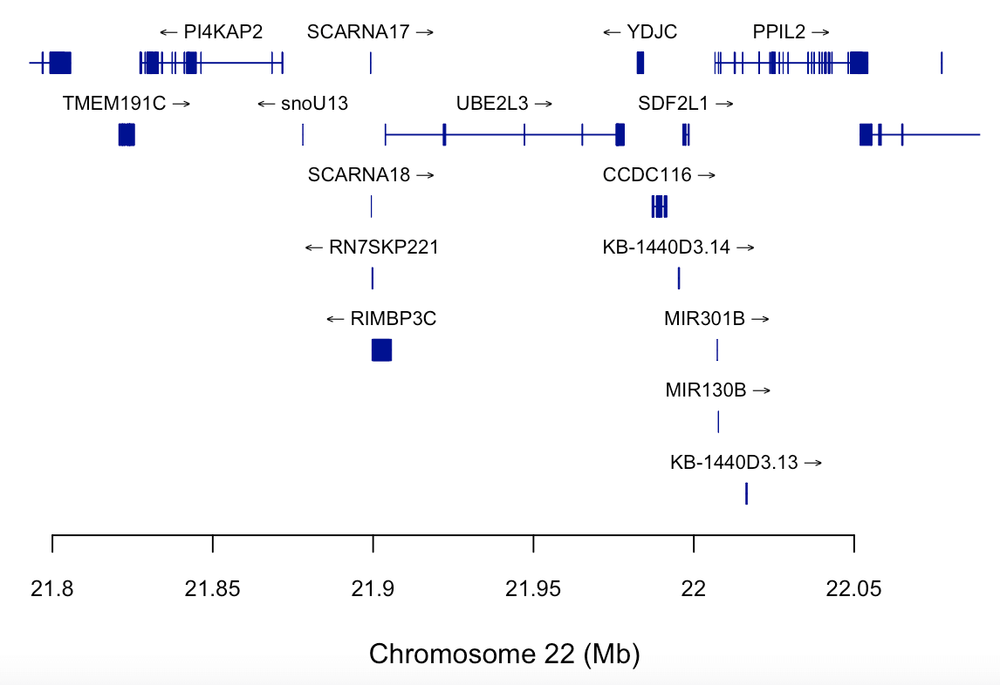

```{r, include = FALSE}
knitr::opts_chunk$set(
  collapse = TRUE
)
```

# Introduction

The `locuszoomr` package allows user to produce publication ready gene locus 
plots very similar to those produced by the web interface locuszoom 
(http://locuszoom.org), but running purely locally in R. It provides 
customisation to the plots.

These gene annotation plots are produced via R base graphics system. For users
who prefer the grid system we recommend looking at Bioconductor packages `Gviz`
or `ggbio`.

# Installation

Bioconductor packages `ensembldb` and an Ensembl database package are required 
before installation.

```{r eval = FALSE}
if (!requireNamespace("BiocManager", quietly = TRUE))
  install.packages("BiocManager")
BiocManager::install("ensembldb")
BiocManager::install("EnsDb.Hsapiens.v75")
```

Install from Github
```{r eval = FALSE}
devtools::install_github("myles-lewis/locuszoomr")
library(locuszoomr)
```

`locuszoomr` automatically leverages the `LDlinkR` package to query 1000 Genomes 
for linkage disequilibrium (LD) across SNPs. In order to make use of this API
function you will need a personal access token (see the `LDlinkR` vignette), 
available from the LDlink website https://ldlink.nci.nih.gov/?tab=apiaccess.

Requests to LDlink are cached using the `memoise` package, to reduce API 
requests. This is helpful when modifying plots for aesthetic reasons.

# Example locus plot

```{r eval = FALSE}
# Locus plot using SLE GWAS data from Bentham et al 2015
# FTP download full summary statistics from
# https://www.ebi.ac.uk/gwas/studies/GCST003156
library(data.table)
SLE_gwas <- fread('../bentham_2015_26502338_sle_efo0002690_1_gwas.sumstats.tsv')

loc <- locus(SLE_gwas, gene = 'UBE2L3', flank = 1e5, LDtoken = "..")
plot(loc)
```

```{r locus1, echo = FALSE, message=FALSE, fig.show='hold', out.width='80%', out.extra='style="border: 0;"'}

```

```{r eval = FALSE}
# Filter by gene biotype
plot(loc, filter_gene_biotype = "protein_coding")

# Custom selection of genes using gene names
plot(loc, filter_gene_name = c('UBE2L3', 'RIMBP3C', 'YDJC', 'PPIL2',
                                     'PI4KAP2', 'MIR301B'))
```

# Arrange multiple plots

`locuszoomr` uses `graphics::layout` to arrange plots. To layout multiple locus plots side by side, specify layout manually and set the argument `use_layout = FALSE` when plotting locus objects.

```{r eval = FALSE}

loc2 <- locus(SLE_gwas, gene = 'STAT4', flank = 1e5, LDtoken = "..")
loc3 <- locus(SLE_gwas, gene = 'IRF5', flank = c(7e4, 2e5), LDtoken = "..")

# multiplot
oldpar <- par(no.readonly = TRUE)
mat <- matrix(c(2:1, 4:3, 6:5), nrow = 2)
graphics::layout(mat, heights = c(3, 2))
plot(loc, use_layout = FALSE, legend_pos = 'topleft')
plot(loc2, use_layout = FALSE, legend_pos = NULL)
plot(loc3, use_layout = FALSE, legend_pos = NULL)
par(oldpar)
```

```{r mukti, echo = FALSE, message=FALSE, fig.show='hold', out.width='100%', out.extra='style="border: 0;"'}

```

# Plot gene annotation only

The gene track can be plotted from a `locus` class object using the function 
`genetrack()`. This uses base graphics, so `layout()` can be used to stack 
custom-made plots above or below the gene tracks.

```{r eval = FALSE}
genetracks(loc)
```

```{r locus2, echo = FALSE, message=FALSE, fig.show='hold', out.width='80%', out.extra='style="border: 0;"'}

```

The function allows control over plotting of the gene tracks.

```{r eval = FALSE}
# Limit the number of tracks
genetracks(loc, maxrows = 4)

# Filter by gene biotype
genetracks(loc, filter_gene_biotype = 'protein_coding')

# Customise colours
genetracks(loc, gene_col = 'grey', exon_col = 'orange', exon_border = 'darkgrey')
```
