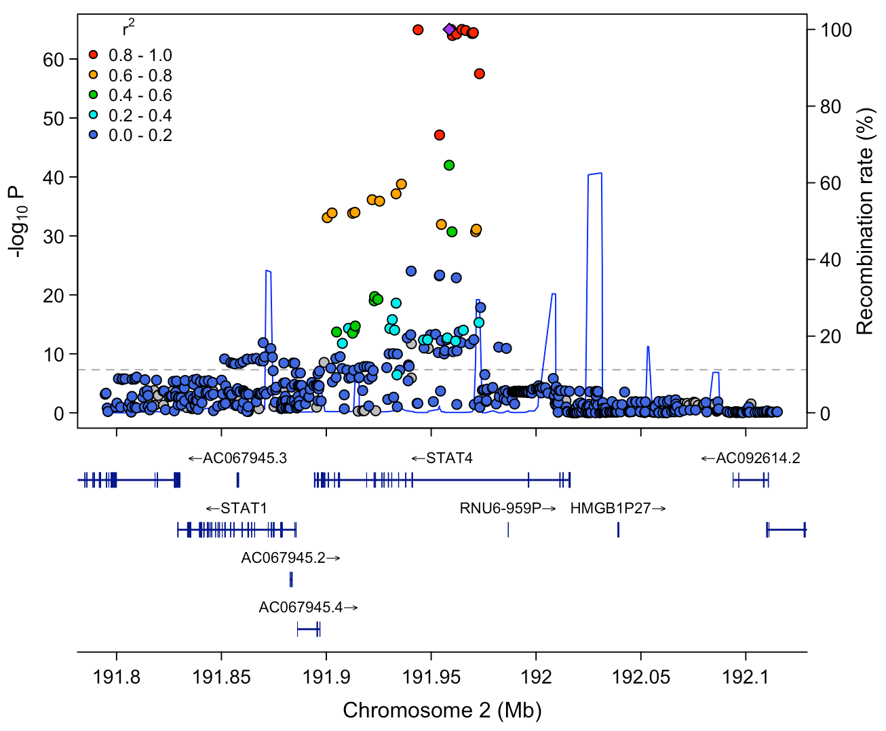
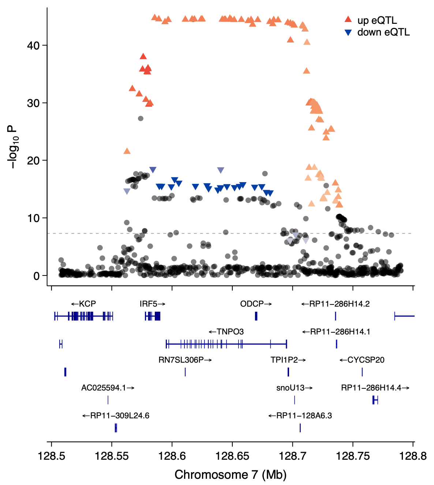
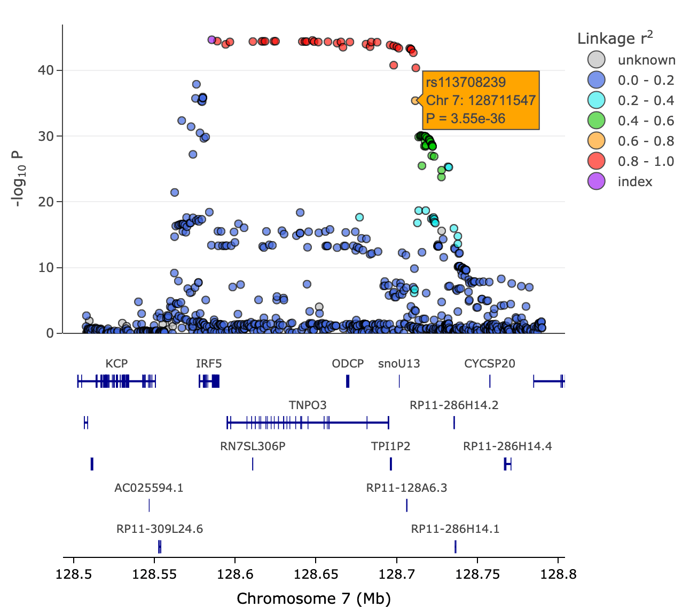

```{r, include = FALSE}
knitr::opts_chunk$set(
  collapse = TRUE
)
library(locuszoomr)
```

# Introduction

The `locuszoomr` package allows users to produce publication ready gene locus 
plots very similar to those produced by the web interface 'locuszoom' 
(http://locuszoom.org), but running purely locally in R. Plots can easily be 
customised, labelled and stacked.

These gene annotation plots are produced via R base graphics or 'ggplot2'. A
'plotly' version can also be generated.

# Installation

Bioconductor packages `ensembldb` and an Ensembl database installed either as a
package or obtained through Bioconductor packages `AnnotationHub` are required
before installation. To run the examples in this vignette the
'EnsDb.Hsapiens.v75' ensembl database package needs to be installed from
Bioconductor.

```{r eval = FALSE}
if (!requireNamespace("BiocManager", quietly = TRUE))
  install.packages("BiocManager")
BiocManager::install("ensembldb")
BiocManager::install("EnsDb.Hsapiens.v75")
```

Install from CRAN
```{r eval = FALSE}
install.packages("locuszoomr")
```

Install from Github
```{r eval = FALSE}
devtools::install_github("myles-lewis/locuszoomr")
```

`locuszoomr` can access the `LDlinkR` package to query 1000 Genomes for linkage
disequilibrium (LD) across SNPs. In order to make use of this API function you
will need a personal access token, available from the
[LDlink website](https://ldlink.nih.gov/?tab=apiaccess).

We recommend that users who want to add recombination rate lines to multiple
plots download the recombination rate track from UCSC and use it as described in
the section [Add recombination rate](#add-recombination-rate).

# Example locus plot

The quick example below uses a small subset (3 loci) of a GWAS dataset
incorporated into the package as a demo. The dataset is from a genetic study on
Systemic Lupus Erythematosus (SLE) by Bentham et al (2015). The full GWAS
summary statistics can be downloaded from
https://www.ebi.ac.uk/gwas/studies/GCST003156. The data format is shown below.

```{r}
library(locuszoomr)
data(SLE_gwas_sub)  ## limited subset of data from SLE GWAS
head(SLE_gwas_sub)
```

We plot a locus from this dataset by extracting a subset of the data using the
`locus()` function. Make sure you load the correct Ensembl database.

```{r, message=FALSE, fig.dim=c(8, 7)}
if (require(EnsDb.Hsapiens.v75)) {
loc <- locus(data = SLE_gwas_sub, gene = 'UBE2L3', flank = 1e5,
             ens_db = "EnsDb.Hsapiens.v75")
summary(loc)
locus_plot(loc)
}
```

For users who only want to plot the gene tracks alone alongside their own plots, 
see section [Plot gene annotation only](#plot-gene-annotation-only) below.

When `locus()` is called, the function tries to autodetect which columns in the
data object refer to chromosome, position, SNP/feature ID and p-value. These
columns may need to be specified manually using the arguments `chrom`, `pos`,
`labs` and `p` respectively.

# Accessing Ensembl databases

Ensembl databases up to version 86 for *Homo sapiens* were loaded as individual
packages on Bioconductor. Recent databases are available through the
`AnnotationHub` Bioconductor package. Below we show a toy example to load
*H. sapiens* ensembl database v106 (even though it is misaligned with the
genotype data). If the argument `ens_db` in `locus()` is a character string it
specifies an Ensembl package which is queried through `get()`. For
`AnnotationHub` databases `ens_db` needs to be set to be the object containing
the database (not a string).

```{r eval=FALSE}
library(AnnotationHub)
ah <- AnnotationHub()
query(ah, c("EnsDb", "Homo sapiens"))
```

```{r eval=FALSE}
## AnnotationHub with 25 records
## # snapshotDate(): 2023-04-25
## # $dataprovider: Ensembl
## # $species: Homo sapiens
## # $rdataclass: EnsDb
## # additional mcols(): taxonomyid, genome, description, coordinate_1_based, maintainer,
## #   rdatadateadded, preparerclass, tags, rdatapath, sourceurl, sourcetype
## # retrieve records with, e.g., 'object[["AH53211"]]'
## 
##              title
##   AH53211  | Ensembl 87 EnsDb for Homo Sapiens
##   ...        ...
##   AH100643 | Ensembl 106 EnsDb for Homo sapiens
##   AH104864 | Ensembl 107 EnsDb for Homo sapiens
##   AH109336 | Ensembl 108 EnsDb for Homo sapiens
##   AH109606 | Ensembl 109 EnsDb for Homo sapiens
##   AH113665 | Ensembl 110 EnsDb for Homo sapiens
```

Fetch ensembl database version 106.

```{r eval=FALSE}
ensDb_v106 <- ah[["AH100643"]]

# built-in mini dataset
data("SLE_gwas_sub")
loc <- locus(data = SLE_gwas_sub, gene = 'UBE2L3', fix_window = 1e6,
             ens_db = ensDb_v106)
locus_plot(loc)
```

# Controlling the locus

The genomic locus can be specified in several ways. The simplest is to specify a
gene by name/symbol using the `gene` argument. The location of the gene is
obtained from the specified Ensembl database. The amount of flanking regions can
either be controlled by specifying `flank` which defaults to 50kb either side of
the ends of the gene. `flank` can either be a single number or a vector of 2
numbers if different down/upstream flanking lengths are required. Alternatively
a fixed genomic window (eg. 1 Mb) centred on the gene of interest can be
specified using the argument `fix_window`. The locus can be specified
manually by specifying the chromosome using `seqname` and genomic position range
using `xrange`. Finally, a region can be specified by naming the `index_snp`, in
which case the object `data` is searched for the coordinates of that SNP and the
size of the region defined using `fix_window` or `flank`.

# Obtaining LD information

Once an API personal access token has been obtained, the
[LDlink](https://ldlink.nih.gov/?tab=home) API can be called using the function
`link_LD()` to retrieve LD (linkage disequilibrium) information at the locus
which is overlaid on the locus plot. This is shown as a colour overlay showing
the level of $r^2$ between SNPs and the index SNP which defaults to the SNP with
the lowest p-value (or the SNP can be specified manually). Requests to LDlink
are cached using the `memoise` package, to reduce API requests.

```{r eval = FALSE}
# Locus plot using SLE GWAS data from Bentham et al 2015
# FTP download full summary statistics from
# https://www.ebi.ac.uk/gwas/studies/GCST003156
library(data.table)
SLE_gwas <- fread('../bentham_2015_26502338_sle_efo0002690_1_gwas.sumstats.tsv')
loc <- locus(SLE_gwas, gene = 'UBE2L3', flank = 1e5,
             ens_db = "EnsDb.Hsapiens.v75")
loc <- link_LD(loc, token = "your_token")
locus_plot(loc)
```

The subset of GWAS data included in the `locuszoomr` package has LD data already
acquired from LDlink which is included in the `r2` column. This can be plotted
by setting `LD = "r2"`. This method also allows users to add their own LD
information from their own datasets to loci.

```{r, fig.dim=c(8, 7)}
if (require(EnsDb.Hsapiens.v75)) {
loc <- locus(SLE_gwas_sub, gene = 'UBE2L3', flank = 1e5, LD = "r2",
             ens_db = "EnsDb.Hsapiens.v75")
locus_plot(loc, labels = c("index", "rs140492"),
                label_x = c(4, -5))
}
```

# Add recombination rate

In keeping with the original locuszoom, recombination rate can be shown on a
secondary *y* axis using the `link_recomb()` function to retrieve recombination
rate data from [UCSC genome browser](https://genome.ucsc.edu). Calls to UCSC are 
cached using `memoise` to reduce API requests.

```{r eval=FALSE}
loc3 <- locus(SLE_gwas_sub, gene = 'STAT4', flank = 1e5, LD = "r2",
              ens_db = "EnsDb.Hsapiens.v75")
loc3 <- link_recomb(loc3)
locus_plot(loc3)
```

```{r, out.width='80%', echo=FALSE}

```

If you are performing multiple UCSC queries, it is much faster to download the
whole recombination rate track data file (around 30 MB) from UCSC genome browser
(documented [here](https://genome.ucsc.edu/cgi-bin/hgTrackUi?g=recombRate2)).

The download site can be accessed at
http://hgdownload.soe.ucsc.edu/gbdb/hg38/recombRate/. For hg38, download
`recomb1000GAvg.bw`.

For hg19, the link is http://hgdownload.soe.ucsc.edu/gbdb/hg19/decode/ and the
default track we use is `hapMapRelease24CombinedRecombMap.bw`.

The .bw track file can then be loaded into R as a `GRanges` object using
`import.bw()`, and then used directly by `link_recomb()` as follows:

```{r eval=FALSE}
library(rtracklayer)
recomb.hg19 <- import.bw("/../hapMapRelease24CombinedRecombMap.bw")
loc3 <- link_recomb(loc3, recomb = recomb.hg19)
locus_plot(loc3)
```

# Customise plots and labels

Various plotting options can be customised through arguments via the call to
`locus_plot()`. When calling `locus_plot()` arguments are passed to either
`genetracks()` to control the gene tracks or passed via the `...` system onto
`scatter_plot()` to control the scatter plot.

Plot borders can be set using `border = TRUE`. The chromosome 
position $x$ axis labels can be placed under the top or bottom plots using 
`xtick = "top"` or `"bottom"`.

Additional arguments can also be passed onto `plot()` via the `...` system, e.g.
`ylim`, `par()` settings etc. For example `col = NA` can be added to
`locus_plot()` or `scatter_plot()` to remove the black outline around the
scatter plot markers.

Labels can be added by specifying a vector of SNP or genomic feature IDs as
shown in the plot above using the argument `labels` (see `scatter_plot()`). The
value `"index"` refers to the index SNP as the highest point in the locus or as
defined by the argument `index_snp` when `locus()` is called. The easiest way to
identify points is using the [plotly version](#plotly-version) `locus_plotly()`
which allows you to hover over points and see their rsid or feature label.
`label_x` and `label_y` control the position of the labels and can be specified
as a single value or a vector of values.

## Point shapes

Advanced users familiar with base graphics can customise every single point
on the scatter plot, by adding columns named `bg`, `col`, `pch` or `cex`
directly to the dataframe stored in `$data` element of the `locus` object.
Setting these will overrule any default settings. These columns refer to their
respective base graphics arguments: `bg` sets the fill colour for points, `col`
sets the outline colour, `pch` sets the symbols (see `?points` for a list of
these) and `cex` sets the size of points (default is 1).

```{r eval=FALSE}
# add column 'typed' as a factor which is 1 for typed, 0 for imputed
loc$data$typed <- factor(rbinom(n = nrow(loc$data), 1, 0.3))
# convert column to shapes by adding a column called 'pch'
loc$data$pch <- c(21, 24)[loc$data$typed]
locus_plot(loc)
# pch 21 = circles = imputed
# pch 24 = triangles = typed
```

See the help pages at `?locus_plot` and `?scatter_plot` for more details.

# Customise gene tracks

The gene tracks can be also customised with colours and gene label text
position. See the help page at `?genetracks` and `?locus_plot` for more details.

```{r eval = FALSE}
# Filter by gene biotype
locus_plot(loc, filter_gene_biotype = "protein_coding")

# Custom selection of genes using gene names
locus_plot(loc, filter_gene_name = c('UBE2L3', 'RIMBP3C', 'YDJC', 'PPIL2',
                                     'PI4KAP2', 'MIR301B'))
```

# Plot gene annotation only

The gene track can be plotted from a `locus` class object using the function 
`genetracks()`. This uses base graphics, so `layout()` can be used to stack 
custom-made plots above or below the gene tracks. The function `set_layers()` is
designed to make this easier for users. See section [Layering
plots](#layering-plots) below.

```{r, fig.dim=c(7, 3.5)}
if (require(EnsDb.Hsapiens.v75)) {
genetracks(loc, highlight = "UBE2L3")
}
```

The function allows control over plotting of the gene tracks such as changing
the number of gene annotation tracks and the colour scheme. Set
`showExons=FALSE` to show only genes and hide the exons.

```{r, fig.dim=c(7, 2.5)}
if (require(EnsDb.Hsapiens.v75)) {
# Limit the number of tracks
# Filter by gene biotype
# Customise colours
genetracks(loc, maxrows = 3, filter_gene_biotype = 'protein_coding',
           gene_col = 'grey', exon_col = 'orange', exon_border = 'darkgrey')
}
```

For advanced users who only want the gene tracks to add to their own plots,
`locus()` can be called without the `data` argument specified (or `data` can be
set to `NULL`). Then genetracks can be plotted in base graphics, ggplot2 or 
plotly.

```{r eval = FALSE}
loc00 <- locus(gene = 'UBE2L3', flank = 1e5, ens_db = "EnsDb.Hsapiens.v75")

genetracks(loc00)  # base graphics
gg_genetracks(loc00)  # ggplot2
genetrack_ly(loc00)  # plotly
```

# Add eQTL data via LDlink

GTEx eQTL data can be accessed via the LDlinkR package which queries the
[LDlink](https://ldlink.nih.gov/?tab=home) server API to download data and add
it to a 'locus' object. The eQTL data is stored in `LDexp` slot in the locus
object.

```{r eval=FALSE}
# obtain GTEx eQTL data from LDlinkR
# needs personal access token for LDlink
loc2 <- locus(SLE_gwas_sub, gene = 'IRF5', flank = c(7e4, 2e5), LD = "r2",
              ens_db = "EnsDb.Hsapiens.v75")
loc2 <- link_eqtl(loc2, token = "..")
head(loc2$LDexp)  # show eQTL data
```

Often at a locus eQTL data may be available on a range of genes and tissues. The
following code shows how to see which genes and tissues are available and how
eQTL SNPs they each have.

```{r eval=FALSE}
table(loc2$LDexp$Gene_Symbol)
##      AHCYL2           IRF5            KCP        METTL2B           NRF1   RP11-212P7.2 
##           5           1618              1              2              9              3 
## ...

table(loc2$LDexp$Tissue)
##             Adipose - Subcutaneous          Adipose - Visceral (Omentum) 
##                                 78                                    69 
##                      Adrenal Gland                        Artery - Aorta 
##                                 38                                   109
## ...
```

Embedded eQTL data can be plotted using `eqtl_plot()` or shown as an overlay
plot using `overlay_plot()` which shows GWAS or association data on the *y* axis
and overlays eQTL results using symbols and colours.

```{r eval=FALSE}
# just plot eQTL results
eqtl_plot(loc2, tissue = "Whole Blood", eqtl_gene = "IRF5")

# overlay eqtl plot
overlay_plot(loc2, eqtl_gene = "IRF5")
```

```{r, out.width='60%', fig.align="center", echo=FALSE}

```

# Change *y*-axis variable

Instead of plotting -log~10~ p-value on the y axis, it is possible to specify a
different variable in your dataset using the argument `yvar`.

```{r, fig.dim=c(8, 7)}
if (require(EnsDb.Hsapiens.v75)) {
locb <- locus(SLE_gwas_sub, gene = 'UBE2L3', flank = 1e5, yvar = "beta",
              ens_db = "EnsDb.Hsapiens.v75")
locus_plot(locb)
}
```

# Arrange multiple locus plots

`locuszoomr` uses `graphics::layout` to arrange plots. To layout multiple locus
plots side by side, use the function `multi_layout()` to set the number of locus
plots per row and column. The `plots` argument in `multi_layout()` can either be
a list of locus class objects, one for each gene. Or for full control it can be
an 'expression' with a series of manual calls to `locus_plot()`. Alternatively a
`for` loop could be called within the `plots` expression.

```{r eval = FALSE}
genes <- c("STAT4", "IRF5", "UBE2L3")

# generate list of 'locus' class objects, one for each gene
loclist <- lapply(genes, locus,
                  data = SLE_gwas_sub,
                  ens_db = "EnsDb.Hsapiens.v75",
                  LD = "r2")

## produce 3 locus plots, one on each page
pdf("myplot.pdf")
multi_layout(loclist)
dev.off()

## place 3 locus plots in a row on a single page
pdf("myplot.pdf")
multi_layout(loclist, ncol = 3, labels = "index")
dev.off()

## full control
loc2 <- locus(SLE_gwas_sub, gene = 'IRF5', flank = c(7e4, 2e5), LD = "r2",
              ens_db = "EnsDb.Hsapiens.v75")
loc3 <- locus(SLE_gwas_sub, gene = 'STAT4', flank = 1e5, LD = "r2",
              ens_db = "EnsDb.Hsapiens.v75")

pdf("myplot.pdf", width = 9, height = 6)
multi_layout(ncol = 3,
             plots = {
               locus_plot(loc, use_layout = FALSE, legend_pos = 'topleft')
               locus_plot(loc2, use_layout = FALSE, legend_pos = NULL)
               locus_plot(loc3, use_layout = FALSE, legend_pos = NULL,
                          labels = "index")
             })
dev.off()
```

```{r, echo=FALSE, message=FALSE, fig.dim = c(9,5)}
if (require(EnsDb.Hsapiens.v75)) {
loc2 <- locus(SLE_gwas_sub, gene = 'IRF5', flank = c(7e4, 2e5), LD = "r2",
              ens_db = "EnsDb.Hsapiens.v75")
loc3 <- locus(SLE_gwas_sub, gene = 'STAT4', flank = 1e5, LD = "r2",
              ens_db = "EnsDb.Hsapiens.v75")

multi_layout(ncol = 3,
             plots = {
               locus_plot(loc, use_layout = FALSE, legend_pos = 'topleft')
               locus_plot(loc2, use_layout = FALSE, legend_pos = NULL)
               locus_plot(loc3, use_layout = FALSE, legend_pos = NULL,
                          labels = "index")
             })
}
```

# Layering plots

## Column of plots

`locuszoomr` has been designed with modular functions to enable layering of
plots on top of each other in a column with gene tracks on the bottom.
`set_layers()` is used to set layout of plots in base graphics by calling
`layout()`. You will need to reset `par()` to original layout settings once the
multi-panel plot is finished.

`scatter_plot()` is used to generate the locus plot. `line_plot()` is used as an
example of an additional plot. Also see `eqtl_plot()` for plotting eQTL
information retrieved via the LDlinkR package.

```{r eval=FALSE}
pdf("myplot2.pdf", width = 6, height = 8)
# set up layered plot with 2 plots & a gene track; store old par() settings
oldpar <- set_layers(2)
scatter_plot(loc, xticks = FALSE)
line_plot(loc, col = "orange", xticks = FALSE)
genetracks(loc)
par(oldpar)  # revert par() settings
dev.off()
```

```{r, echo=FALSE, fig.dim = c(6,8)}
if (require(EnsDb.Hsapiens.v75)) {
oldpar <- set_layers(2)
scatter_plot(loc, xticks = FALSE)
line_plot(loc, col = "orange", xticks = FALSE)
genetracks(loc)
par(oldpar)
}
```

## Overlaid plots

`scatter_plot()` can be called with argument `add = TRUE` to add multiple sets
of points overlaid on one plot.

```{r, message=FALSE, fig.dim = c(7,7)}
if (require(EnsDb.Hsapiens.v75)) {
dat <- SLE_gwas_sub
dat$p2 <- -log10(dat$p * 0.1)
locp <- locus(dat, gene = 'UBE2L3', flank = 1e5, ens_db = "EnsDb.Hsapiens.v75")
locp2 <- locus(dat, gene = 'UBE2L3', flank = 1e5, yvar = "p2",
               ens_db = "EnsDb.Hsapiens.v75")

oldpar <- set_layers(1)
scatter_plot(locp, xticks = FALSE, pcutoff = NULL, ylim = c(0, 16))
scatter_plot(locp2, xticks = FALSE, pcutoff = NULL, scheme = "orange",
             pch = 22, add = TRUE)
genetracks(loc)
par(oldpar)
}
```

# Add custom legend / features

The power of base graphics is that it gives complete control over plotting. In
the example below, we show how to add your own legend, text labels, lines to
demarcate a gene and extra points on top or underneath the main plot. When
`plot()` is called, base graphics allows additional plotting using the arguments
`panel.first` and `panel.last`. Since these are called inside the `locus_plot()`
function they need to be quoted using `quote()`.

```{r, fig.dim = c(7,7)}
if (require(EnsDb.Hsapiens.v75)) {
# add vertical lines for gene of interest under the main plot
pf <- quote({
  v <- locp$TX[locp$TX$gene_name == "UBE2L3", c("start", "end")]
  abline(v = v, col = "orange")
})

pl <- quote({
  # add custom text label for index SNP
  lx <- locp$data$pos[locp$data$rsid == locp$index_snp]
  ly <- locp$data$logP[locp$data$rsid == locp$index_snp]
  text(lx, ly, locp$index_snp, pos = 4, cex = 0.8)
  # add extra points
  px <- rep(22.05e6, 3)
  py <- 10:12
  points(px, py, pch = 21, bg = "green")
  # add custom legend
  legend("topleft", legend = c("group A", "group B"),
         pch = 21, pt.bg = c("blue", "green"), bty = "n")
})

locus_plot(locp, pcutoff = NULL, panel.first = pf, panel.last = pl)
}
```

# ggplot2 version

`ggplot2` versions of several of the above functions are available. For a whole
locus plot use `locus_ggplot()`.

```{r, eval=FALSE}
locus_ggplot(loc)
```

The gene tracks can be produced on their own as a ggplot2 object using
`gg_genetracks()`.

```{r, eval=FALSE}
gg_genetracks(loc)
```

The scatter plot alone can be produced as a ggplot2 object.

```{r, eval=FALSE}
p <- gg_scatter(loc)
p
```

Finally, `gg_addgenes()` can be used to add gene tracks to an existing ggplot2
plot that has been previously created and customised.

```{r, eval=FALSE}
gg_addgenes(p, loc)
```

## Shapes

Shapes can be overlaid in the scatter plot by setting either `beta` or `shape`
to a column name in the dataset. Setting `beta` shows up-triangles for positive
beta values and down-triangles for negative beta values. If `shape` is set, for
example to show imputed vs typed SNPs, the column needs to be a factor (to make
the legend nice). `shape_values` is then set as a vector of shapes to which the
levels of the factor are mapped on the scatter plot.

```{r eval=FALSE}
locus_ggplot(loc, beta = "beta")

# add column 'typed' as a factor with levels "typed", "imputed"
loc$data$typed <- factor(rbinom(n = nrow(loc$data), 1, 0.3), labels = c("imputed", "typed"))
locus_ggplot(loc, shape = "typed")
```

## Layering plots

Plots can be layered above gene tracks, using `cowplot::plot_grid()` or using
the `patchwork` package.

```{r, eval=FALSE}
g <- gg_genetracks(loc)
library(cowplot)
plot_grid(p, p, g, ncol = 1, rel_heights = c(2, 2, 1), align = "v")

# patchwork method
library(patchwork)
p / p / g

# patchwork method 2
wrap_plots(p, p, g, ncol = 1)
```

For users who prefer the grid system we recommend also looking at Bioconductor
packages `Gviz` or `ggbio` as possible alternatives.

## Arrange multiple ggplots

It is possible to use either the `cowplot` or `ggpubr` packages to layout
multiple locus ggplots on the same page.

```{r, fig.dim = c(12, 7)}
if (require(EnsDb.Hsapiens.v75)) {
library(cowplot)
p1 <- locus_ggplot(loc, labels = "index", nudge_x = 0.03)
p2 <- locus_ggplot(loc2, legend_pos = NULL)
plot_grid(p1, p2, ncol = 2)
}
```

Or using ggpubr or gridExtra:

```{r eval=FALSE}
library(ggpubr)
pdf("my_ggplot.pdf", width = 10)
ggarrange(p1, p2, ncol = 2)
dev.off()

library(gridExtra)
pdf("my_ggplot.pdf", width = 10)
grid.arrange(p1, p2, ncol = 2)
dev.off()
```

A known issue with the ggplot2 version `locus_ggplot()` is that the system for
ensuring that gene labels seems to go wrong when the plot window is resized
during arrangement of multiple plots. The workable solution at present is to
make sure that the height and width of the final pdf/output is enlarged as per
the example above, which plots fine without any text overlapping when exported
to pdf at an appropriate size.

# Plotly version

`locuszoomr` includes a ['plotly'](https://plotly.com/r/) version for plotting
locus plots which is interactive. This allows users to hover over the plot and
reveal additional information such as SNP rs IDs for each point and information
about each gene in the gene tracks. This can help when exploring a locus or
region and trying to identify particular SNPs (or genomic features) of interest.

```{r eval=FALSE}
locus_plotly(loc2)
```

```{r, out.width='70%', fig.align="center", echo=FALSE}

```

# Plot all GWAS peaks

`locuszoomr` includes a function `quick_peak()` to quickly find GWAS peaks based
on a set p-value threshold (default 5e-08) and specifying a minimum distance
between peaks (default 1 Mb). The function will either find all peaks ordered by
lowest p-value, or the top *n* peaks can be identified by setting `npeaks`.

```{r eval=FALSE}
# FTP download full summary statistics of this SLE GWAS from
# https://www.ebi.ac.uk/gwas/studies/GCST003156
library(data.table)
SLE_gwas <- fread('../bentham_2015_26502338_sle_efo0002690_1_gwas.sumstats.tsv')

pks <- quick_peak(SLE_gwas)
## 34 peaks found (0.328 secs)

top_snps <- SLE_gwas$rsid[pks]
head(top_snps)
## [1] "rs141910407" "rs114056368" "rs4274624"   "rs17849501"  "rs1143679"   "rs114115096"
```

We can now plot locus plots for all the GWAS peaks as a single pdf, as specified
by the vector of top SNPs. The `link_recomb()` line below can be sped up by
downloading the recombination track file from UCSC - see example code in 
[Add recombination rate](#add-recombination-rate).

```{r eval=FALSE}
all_loci <- lapply(top_snps, function(i) {
  loc <- locus(data = SLE_gwas, index_snp = i, fix_window = 1e6,
        ens_db = "EnsDb.Hsapiens.v75")
  link_recomb(loc)
})

pdf("sle_loci.pdf")
tmp <- lapply(all_loci, locus_plot, labels = "index")
dev.off()
```

Alternatively export plots using ggplot2.

```{r eval=FALSE}
pp <- lapply(all_loci, locus_ggplot, labels = "index", nudge_y = 1)

library(gridExtra)
pdf("sle_loci_gg.pdf")
for (i in seq_along(pp)) {
  grid.arrange(pp[[i]])
}
dev.off()
```

# Manhattan & other plots

For Manhattan plots, log p-value QQ plot and easy labelling of volcano plots or
other scatter plots with draggable labels, check out our sister package
`easylabel` on CRAN at https://cran.r-project.org/package=easylabel.

# References

Pruim RJ, Welch RP, Sanna S, Teslovich TM, Chines PS, Gliedt TP, Boehnke M,
Abecasis GR, Willer CJ. (2010) LocusZoom: Regional visualization of genome-wide
association scan results. *Bioinformatics* 2010; 26(18): 2336-7.
