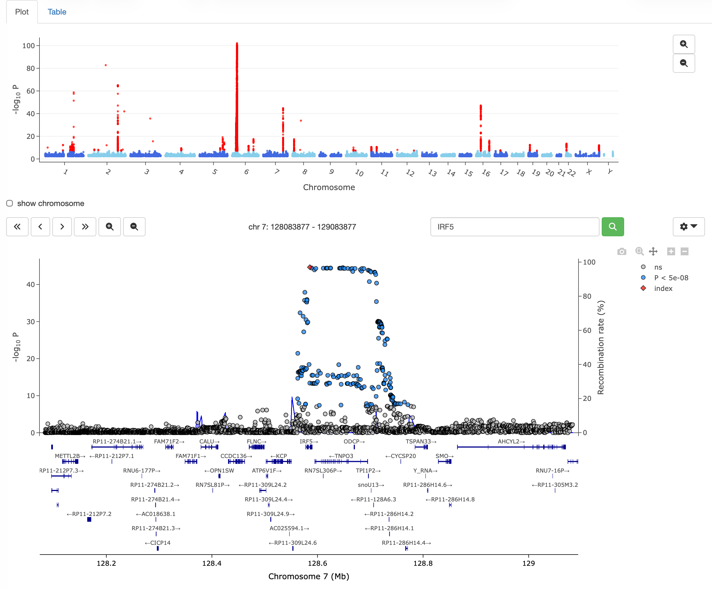
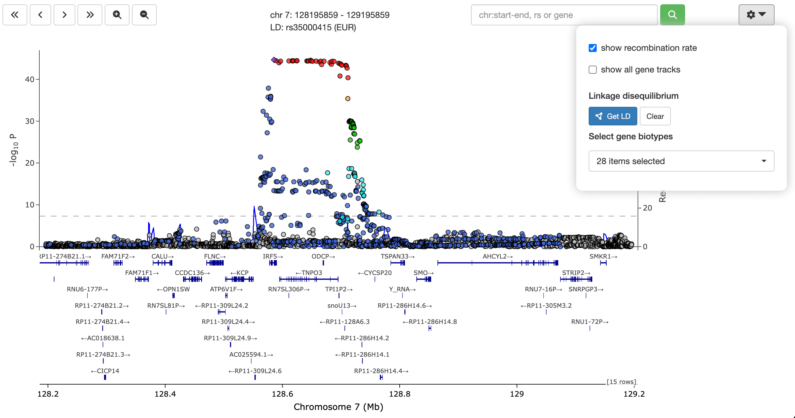

Here we demonstrate how to use the zoom browser to interactively browse whole
genome GWAS or eQTL data.

### Example GWAS data

Example whole genome summary statistics from an SLE GWAS study can be downloaded
from EBI [here](https://www.ebi.ac.uk/gwas/studies/GCST003156) and loaded as follows.
The main locuszoomr vignette shows how this data is formatted.

```{r eval=FALSE}
# FTP download full summary statistics (308 MB) from SLE GWAS from
# https://www.ebi.ac.uk/gwas/studies/GCST003156
library(data.table)
SLE_gwas <- fread('../bentham_2015_26502338_sle_efo0002690_1_gwas.sumstats.tsv')
```

The zoom browser is started using `zoom()`. Like the `locus()` function,
`zoom()` tries to autodetect the columns for SNP id, chromosome, position and
p-value. If you have complex or ambiguous column names, then the arguments
`chrom`, `pos`, `p` and `labs` can be used to specify the appropriate columns in
your dataset.

An appropriate hg19 or hg38 (or other species) ensembl database of
genome information must be specified. In the example below, the GWAS data is
hg19.

```{r eval=FALSE}
library(locuszoomr)
library(EnsDb.Hsapiens.v75)

zoom(SLE_gwas, ens_db = "EnsDb.Hsapiens.v75")
```

```{r, out.width='100%', echo=FALSE}

```

### Navigation

Click on points in the whole genome or individual chromosome manhattan plots to
explore a particular locus. Alternatively, enter a gene name or SNP id or
chromosome position and location into the 
`r shiny::icon("magnifying-glass", style = "background-color: #00CD00")` input 
text box. The locus plot can be navigated by zooming in/out, or moving
left/right using the navigation icons. Dragging the locus plot will move the
locus window. Also, the plotly `r shiny::icon("magnifying-glass")` selection
tool can be used to select a specific region.

The `r shiny::icon("gear")` icon allows users to toggle options such as showing
the recombination rate (only if recomb data has been provided via `recomb`
argument), expanding the gene tracks to show all genes, or selecting individual
genes in eQTL data (if the `eqtl_gene` argument has been set).

### Add recombination rate

Recombination rate can be shown on a secondary *y* axis. Whole recombination
rate track data file (around 30 MB) should be downloaded from UCSC genome
browser (documented
[here](https://genome.ucsc.edu/cgi-bin/hgTrackUi?g=recombRate2)).

The download site can be accessed at
https://hgdownload.soe.ucsc.edu/gbdb/hg38/recombRate/. For hg38, download
`recomb1000GAvg.bw`.

For hg19, the link is https://hgdownload.soe.ucsc.edu/gbdb/hg19/decode/ and the
default track we use is `hapMapRelease24CombinedRecombMap.bw`.

The .bw track file can then be loaded into R as a `GRanges` object using
`import.bw()`, and then used directly by `zoom()`.

```{r eval=FALSE}
library(rtracklayer)
recomb.hg19 <- import.bw("/../hapMapRelease24CombinedRecombMap.bw")

zoom(SLE_gwas, ens_db = "EnsDb.Hsapiens.v75", recomb = recomb.hg19)
```

### Add LD via LDlink

The LDlink API can be queried from within the zoom browser. This requires an
LDlink API access token, which can be obtained from the
[LDlink](https://ldlink.nih.gov/?tab=home) website. The token is then supplied
via the `ld_token` argument when calling `zoom()`.

```{r eval=FALSE}
zoom(SLE_gwas, ens_db = "EnsDb.Hsapiens.v75", recomb = recomb.hg19, ld_token = "my_token")
```

This enables extra buttons for `Get LD` in the `r shiny::icon("gear")` settings
dropdown menu. LD API requests are cached and retained during an R session, so
subsequent requests for the same SNP are much faster. At each locus, the SNP
with the lowest p-value is presumed to the index SNP for LD requests. But
clicking on other points can re-base the LD to alternative SNPs.

```{r, out.width='100%', echo=FALSE}

```

### Citation

If you use this package please cite as:

Lewis MJ, Wang S. (2025) locuszoomr: an R package for visualising
publication-ready regional gene locus plots. *Bioinformatics Advances* 2025;
vbaf006, [doi:10.1093/bioadv/vbaf006](https://doi.org/10.1093/bioadv/vbaf006)
